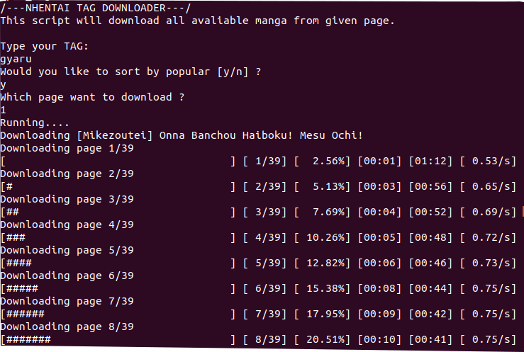

# Download NHentai Mangas without an account

These Ruby sript are to download the nhentai's manga without an account. It does take more time a more than 
to download then individually using the download button method, but you can execute the script and leave it be downloading.

You can download just one manga using the script 'nhentai.rb' and paste the manga's url once the script is executed.

Now, those script 'nhentai_search.rb' and 'nhentai_tag' are to download all page result (nhentai has 25 mangas per page)
from given tag or search.
The program will ask the user to input a search/tag, the page want to be downloaded and if want to download the sort by
recents or popular.

Once the program is executed it creates a new folder with name of your search/tag input and save each manga in their individually folders.



## Installation
### Ruby Installation

First all, you need to have Ruby programming language installed.

Linux (Ubuntu 18.04)
```
sudo apt install ruby-full
```
MacOS
Check out this site https://stackify.com/install-ruby-on-your-mac-everything-you-need-to-get-going/

Windows
Check out this site https://rubyinstaller.org/


## Gems installation
You need to install the following gems in order to run the these scripts

Nokogiri
```
gem install nokogiri 
```
Rest-Client
```
gem install rest-client
```
Open-uri
```
gem install open-uri
```
FileUtils
```
gem install fileutils
```
Progress_bar
```
gem install progress_bar
```
And that's it.   
